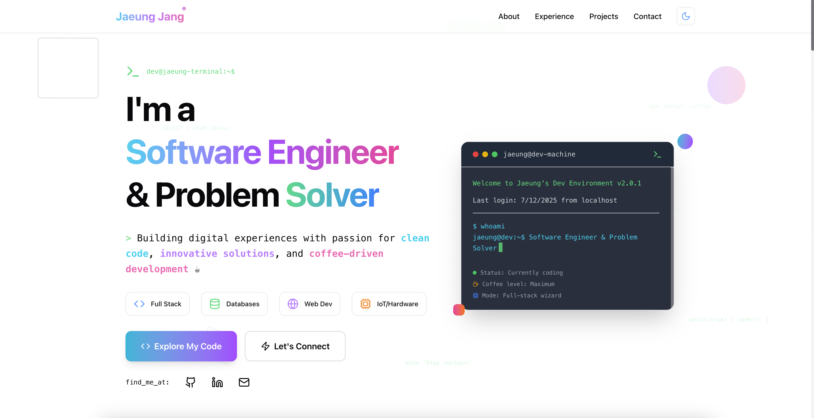

# 🚀 Jaeung Jang - Professional Portfolio

> **Live Site**: [jang.jaeung.com](https://jang.jaeung.com) | **Status**: Production Ready ✅

A modern personal portfolio built with Next.js, TypeScript, and Tailwind CSS. This project showcases contemporary web development practices and clean architecture patterns.

## 🤖 AI-Enhanced Development

This repository was built with assistance from **Claude Sonnet 4**, demonstrating how AI can enhance development proficiency and accelerate delivery time while maintaining code quality and best practices.

## 📸 Portfolio Preview



## ⚡ Technical Features

- **🎯 Modern Stack**: Next.js 15 with App Router, TypeScript, Tailwind CSS 4.0
- **🎨 Smooth Animations**: Framer Motion for enhanced user interactions
- **📱 Responsive Design**: Mobile-first approach with fluid layouts
- **🌙 Theme System**: Dynamic dark/light mode with system preference detection
- **🔍 SEO Ready**: Complete meta tags and Open Graph implementation
- **📊 Analytics**: Vercel Analytics integration
- **📧 Contact API**: Server-side email handling with form validation
- **🚀 Optimized Deployment**: Vercel hosting with continuous deployment

## 🛠️ Enterprise-Grade Tech Stack

**Frontend Architecture**
- **Next.js 15** - Latest App Router with React Server Components
- **TypeScript** - Full type safety and enhanced developer experience
- **Tailwind CSS 4.0** - Utility-first styling with custom design system
- **Framer Motion** - Production-ready animations and micro-interactions

**Developer Experience**
- **ESLint** - Code quality enforcement with custom rules
- **Turbopack** - Next-generation bundler for lightning-fast development
- **PostCSS** - Advanced CSS processing pipeline

**Production Features**
- **Vercel Analytics** - Real-time performance monitoring
- **Nodemailer** - Server-side email API integration
- **next-themes** - Persistent theme management
- **Lucide React** - Optimized icon system

## 🚀 Quick Start Guide

### Prerequisites
- **Node.js 18+** (LTS recommended)
- **npm** or **pnpm** package manager

### Local Development

1. **Clone & Navigate**
```bash
git clone https://github.com/JaeungJayJang/personal_website.git
cd personal_website
```

2. **Install Dependencies**
```bash
npm install
# or
pnpm install
```

3. **Start Development Server** (with Turbopack)
```bash
npm run dev
```

4. **View in Browser**
Open [http://localhost:3000](http://localhost:3000)

The development server uses **Turbopack** for instant hot reloading and optimized build performance.

### Available Commands

| Command | Description | Use Case |
|---------|-------------|----------|
| `npm run dev` | Start development server with Turbopack | Local development |
| `npm run build` | Production build | Pre-deployment testing |
| `npm run start` | Start production server | Local production testing |
| `npm run lint` | ESLint code analysis | Code quality checks |

## �️ Architecture & Code Quality

### Project Structure
```
├── public/                 # Static assets
│   ├── Main_page.png      # Portfolio screenshot
│   ├── favicon.svg        # Site favicon
│   ├── logo.svg           # Brand logo
│   ├── manifest.json      # PWA manifest
│   └── ...                # Other icons and assets
├── src/
│   ├── app/               # Next.js App Router
│   │   ├── api/
│   │   │   └── contact/   # Contact form API endpoint
│   │   │       └── route.ts
│   │   ├── favicon.ico    # App favicon
│   │   ├── globals.css    # Global styles & CSS variables
│   │   ├── layout.tsx     # Root layout with metadata
│   │   └── page.tsx       # Home page component
│   ├── components/        # Reusable React components
│   │   ├── about-section.tsx      # Professional background
│   │   ├── contact-section.tsx    # Contact form with validation
│   │   ├── experience-section.tsx # Work history timeline
│   │   ├── footer.tsx             # Site footer
│   │   ├── header.tsx             # Navigation header
│   │   ├── hero-section.tsx       # Landing section with animations
│   │   ├── logo.tsx               # Logo component
│   │   ├── projects-section.tsx   # Portfolio showcase
│   │   └── theme-provider.tsx     # Theme context provider
│   └── data/              # Content management
│       ├── about.ts       # About section data
│       ├── contact.ts     # Contact information
│       ├── experiences.ts # Work experience data
│       ├── index.ts       # Data exports
│       ├── projects.ts    # Project portfolio data
│       └── site-config.ts # Global site configuration
├── .env.local             # Environment variables
├── deploy.sh              # Deployment script
├── DEPLOYMENT.md          # Deployment documentation
├── eslint.config.mjs      # ESLint configuration
├── next.config.ts         # Next.js configuration
├── package.json           # Dependencies and scripts
├── postcss.config.mjs     # PostCSS configuration
├── tailwind.config.ts     # Tailwind CSS configuration
├── tsconfig.json          # TypeScript configuration
└── vercel.json            # Vercel deployment config
```

### Key Technical Features

**🎨 Design System**
- Custom Tailwind configuration with consistent color palette
- Responsive breakpoints optimized for all devices
- CSS custom properties for theme switching
- Component-based architecture for maintainability

**⚡ Performance Optimizations**
- Image optimization with Next.js built-in `next/image`
- Font optimization with `next/font`
- Lazy loading for off-screen components
- Efficient bundle splitting with App Router

**🔒 Type Safety**
- Comprehensive TypeScript interfaces for all data structures
- Strict type checking enabled
- Type-safe API routes and form handling

## 🌐 Production Deployment

### Live Site
**🔗 [jang.jaeung.com](https://jang.jaeung.com)**

This portfolio is deployed on **Vercel** with continuous deployment from the main branch.

### Deployment Pipeline

**Automatic Deployment**
1. Code pushed to `main` branch triggers Vercel build
2. Vercel runs `npm run build` with optimizations
3. Static assets deployed to global CDN
4. DNS configured with custom domain `jang.jaeung.com`
5. SSL certificate automatically managed by Vercel

**Production Features**
- ⚡ Edge runtime for optimal performance
- 🌍 Global CDN distribution
- 📊 Real-time analytics and monitoring
- 🔒 Automatic HTTPS with security headers
- 🚀 Zero-downtime deployments

### Performance & Deployment
```bash
# Build for production
npm run build

# Test production build locally
npm run start

# Deploy to Vercel (if using Vercel CLI)
vercel --prod
```

## 🤝 Connect

- 📧 **Email**: [wodndckato@gmail.com](mailto:wodndckato@gmail.com)
- 💼 **LinkedIn**: [linkedin.com/in/jaeung-jang](https://linkedin.com/in/jaeung-jang)
- 👨‍💻 **GitHub**: [github.com/JaeungJayJang](https://github.com/JaeungJayJang)
- 🌐 **Portfolio**: [jang.jaeung.com](https://jang.jaeung.com)

### Technologies Demonstrated
- ✅ **Modern React Patterns** - Hooks, Server Components, App Router
- ✅ **TypeScript Implementation** - Type safety and developer experience
- ✅ **Responsive UI/UX** - Professional design with theme switching
- ✅ **API Development** - Server-side functionality with Next.js API routes
- ✅ **Production Deployment** - CI/CD pipeline with Vercel
- ✅ **AI-Assisted Development** - Enhanced productivity with Claude Sonnet 4

---

## 📄 License

This project is open source and available under the [MIT License](LICENSE).

---

*Built with Next.js and enhanced with Claude Sonnet 4 by Jaeung Jang* 🚀
